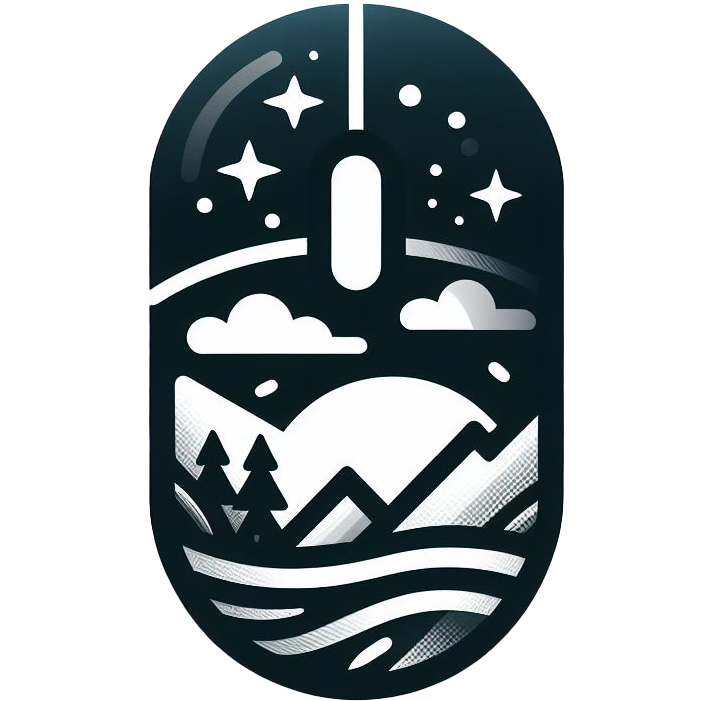
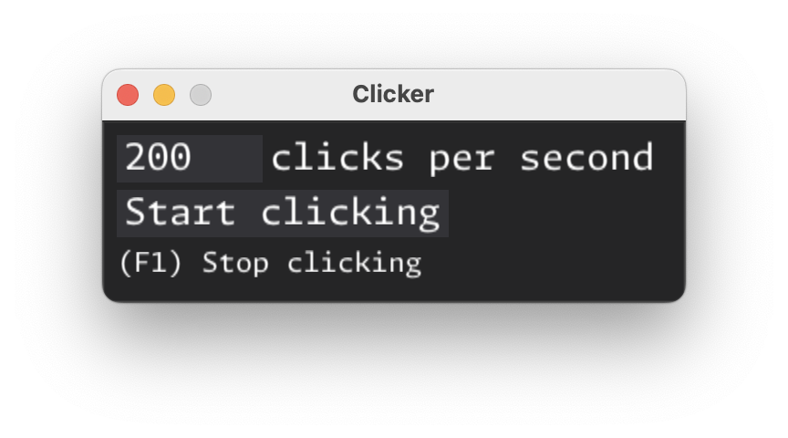

#   Clicker

It clicks, so you don't have to!

[Download Mac App](https://bit.ly/clicker-app-mac-v100)





## Mac instructions

You need to go to System Settings and add Clicker to the following:

1. Privacy & Security -> Accessibility
2. Privacy & Security -> Input Monitoring

These are required so that Clicker can click, and watch for keyboard input to stop clicking.

## Build instructions

### Build Python for nuitka

1. Download [Python 3.11.9](https://www.python.org/ftp/python/3.11.9/Python-3.11.9.tgz)
2. Install Python with `altinstall`

```bash
tar -xzf Python-3.11.9.tgz
cd Python-3.11.9
./configure --prefix=/path/to/home/.local --enable-shared --with-ensurepip=install
make
make altinstall
```

### Create virtual environment

```bash
/path/to/home/.local/bin/python3.11 -m venv venv
```

### Build Mac app

```bash
unset CPPFLAGS && unset LDFLAGS

python -m nuitka clicker.py \
  --output-dir=build \
  --standalone \
  --macos-create-app-bundle \
  --macos-app-icon=assets/icon.icns \
  --macos-signed-app-name=com.aliavni.clicker \
  --macos-app-name=Clicker \
  --follow-imports \
  --include-data-files=assets/MonaspaceArgon-Regular.otf=assets/MonaspaceArgon-Regular.otf
```
